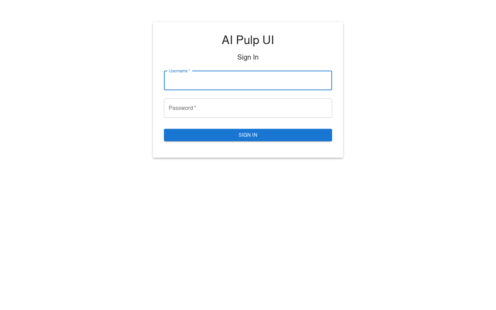
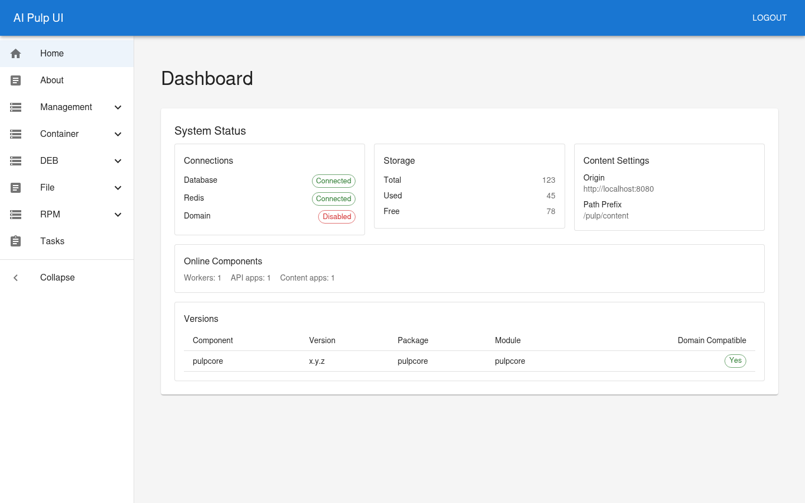
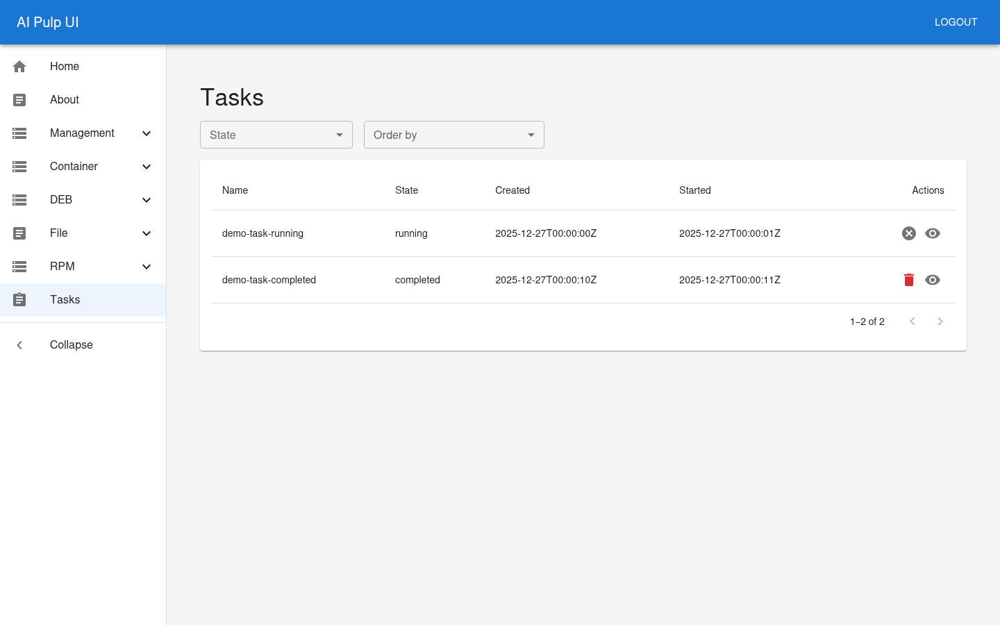

# AI Pulp UI

> Note: Everything in this repository was generated using VS Code and the models GPT-5.2 and Sonnet 4.5.
>
> If you find any bugs or have any requests feel free to raise a github issue.

React + TypeScript frontend for managing Pulp resources (RPM, File, DEB) via the Pulp REST API.

The UI talks to the backend at `http://localhost:8080/pulp/api/v3/` (by default).

- In dev (`npm run dev`), the UI runs on `http://localhost:3000`.
- In Docker (see below), the UI is served from the Pulp container at `http://localhost:8080/ai-pulp-ui/`.

You can override the backend with the `PULP_BACKEND` environment variable (default: `http://localhost:8080`).

## Screenshots







## Requirements

- Node.js 18+ and npm
- Docker or Podman (for the Docker image, or `./tests/run_container.sh`)
- A running Pulp backend on `http://localhost:8080`
  - Option A (recommended for tests): use `./tests/run_container.sh ...` to start an ephemeral Pulp container for the duration of a command
  - Option B: run your own Pulp instance locally and use `npm run dev`

## Quickstart

Install dependencies:

```bash
npm install
```

Run the UI with an ephemeral Pulp backend (starts Pulp, then runs Vite):

```bash
./tests/run_container.sh npm run dev -- --host 0.0.0.0
```

Use a custom backend:

```bash
PULP_BACKEND=http://my-pulp-host:8080 npm run dev
```

Open:

- UI: `http://localhost:3000`
- Pulp API: `http://localhost:8080/pulp/api/v3/`

## API & Proxy

- By default, the frontend uses a relative API base of `/pulp/api/v3` (see [src/services/api.ts](src/services/api.ts)).
- In dev, Vite proxies `/pulp/*` to `http://localhost:8080` by default, or to `PULP_BACKEND` if set (see [vite.config.ts](vite.config.ts)).

## Authentication

- The login form validates credentials against `GET /pulp/api/v3/groups/`.
- Credentials are used as HTTP Basic auth and stored as a base64 token in `localStorage` under `authToken`.

## Build

```bash
npm run build
```

Preview the production build (static server only):

```bash
npm run preview
```

If you want the preview build to talk to a live Pulp backend, serve it behind a reverse proxy that forwards `/pulp/*` to `http://localhost:8080` (the Vite dev proxy only applies to `npm run dev`).

Alternatively, you can build with `PULP_BACKEND` set to make the UI call the backend by absolute URL (note: this may require CORS to be enabled on the backend):

```bash
PULP_BACKEND=http://my-pulp-host:8080 npm run build
```

## Docker (build & run)

This repo’s [Dockerfile](Dockerfile) builds the React UI and bakes the static assets into the upstream Pulp image (`ghcr.io/pulp/pulp:latest`).

- Pulp (API + services) is served on port 80 inside the container.
- The UI is served as a SPA under `/ai-pulp-ui/` via [nginx/ai-pulp-ui.conf](nginx/ai-pulp-ui.conf).

### Build the image

```bash
docker build \
  --tag ai-pulp-ui:local \
  .
```

Build-time configuration (optional):

- `VITE_BASE` (default: `/ai-pulp-ui/`) — where the UI is hosted in the container
- `PULP_BACKEND` (default: `http://localhost:8080`) — backend origin embedded into the UI bundle
- `PULP_EXPOSED_BACKEND` (default: `http://localhost:8080`) — used for “Open” links for distributions (external base URL)

Example (if you will access the container from another machine/hostname):

```bash
docker build \
  --tag ai-pulp-ui:local \
  --build-arg PULP_BACKEND=http://my-host:8080 \
  --build-arg PULP_EXPOSED_BACKEND=http://my-host:8080 \
  .
```

Note: these are *build-time* values (Vite embeds them into the bundle). If they change, rebuild the image.

### Run the container

```bash
docker run --rm \
  --name ai-pulp-ui \
  --publish 8080:80 \
  ai-pulp-ui:local
```

Open:

- UI: `http://localhost:8080/ai-pulp-ui/`
- Pulp API: `http://localhost:8080/pulp/api/v3/`

If you need to set/reset the admin password inside the running container:

```bash
docker exec -it ai-pulp-ui pulpcore-manager reset-admin-password --password password
```

## Tests

Unit/integration tests (Vitest):

```bash
npm test
```

E2E tests (Playwright) against an ephemeral Pulp backend:

```bash
./tests/run_container.sh npm run test:e2e
```

Open the Playwright HTML report:

```bash
npx playwright show-report
```

Notes:

- Playwright tracing is enabled for all E2E tests via [playwright.config.ts](playwright.config.ts).
- For more E2E details, see [e2e/README.md](e2e/README.md).

## Repo Layout

- `src/` React UI (components, services, contexts)
- `e2e/` Playwright tests
- `tests/run_container.sh` helper to start an ephemeral Pulp container and run a command with that backend available

## Pulp Docs

- Pulp user docs: https://pulpproject.org/user/
- REST APIs:
  - RPM: https://pulpproject.org/pulp_rpm/restapi/
  - File: https://pulpproject.org/pulp_file/restapi/
  - DEB: https://pulpproject.org/pulp_deb/restapi/
